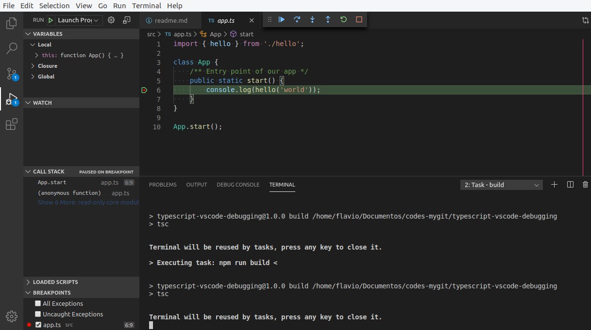

# How to debug TypeScript with VS Code

Debugando Typescript no VSCode.

    // launch.json

    {
      "type": "node",
      "request": "launch",
      "name": "Launch Program",
      "program": "${workspaceFolder}/src/app.ts",
      "outFiles": [
        "${workspaceFolder}/out/**/*.js"
      ],
      "skipFiles": [
        "<node_internals>/**"
      ]
    },
    {
      "type": "node",
      "request": "launch",
      "name": "Build Project",
      "program": "${workspaceFolder}/src/app.ts",
      "preLaunchTask": "npm: build",
      "sourceMaps": true,
      "smartStep": true,
      "internalConsoleOptions": "openOnSessionStart",
      "outFiles": [
        "${workspaceFolder}/out/**/*.js"
      ]
    }

### Fonte

https://medium.com/@PhilippKief/how-to-debug-typescript-with-vs-code-9cec93b4ae56